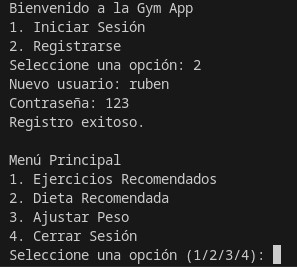

# AIPPY GYM

## ¿En qué consiste?

Es un software que permite crear usuarios y acceder mediante un control de acceso a un menú donde tendremos varias opciones:

1. Ejercicios Recomendados.
2. Dieta Recomendada
3. Ajustar Peso
4. Cerrar Sesión

 

## ¿Cómo funciona?

A través de preguntas, el programa crea una ficha personal para que cada cliente pueda tener un plan de ejercicios y dieta personalizado usando para ello la integración de la API de ChatGPT.

El primer menú tiene dos opciones:

1. **Iniciar Sesión** El usuario inicia sesión si ya se ha registrado con anterioridad. Si su información no está en el sistema, el inicio de sesión fallará y nos dirá que no estamos registrado
2. **Registrarse** El usuario se registra en el sistema si es la primera vez que usa la aplicación. Si se intenta registrar con los mismos datos, el sistema avisará de que el usuario ya existe. 

Luego el programa accede a otro menú con las siguientes opciones:

### 1.Ejercicios Recomendados

A través de preguntas, el programa crea una ficha personal para cada cliente pueda tener un plan de ejercicios personalizado usando para ello la integración de la API de ChatGPT.

### 2.Dieta Recomendada

A través de preguntas, el programa crea un registro para que cada cliente tenga un plan de alimentación personalizado usando para ello la integración de la API de ChatGPT.

### 3.Ajustar Peso

El programa realiza un control o historial de peso. Muestra por pantalla cuánto has ganado o perdido, así como tu índice de masa corporal ideal.

### 4.Cerrar Sesión

Esta opción cierra la sesión del usuario.